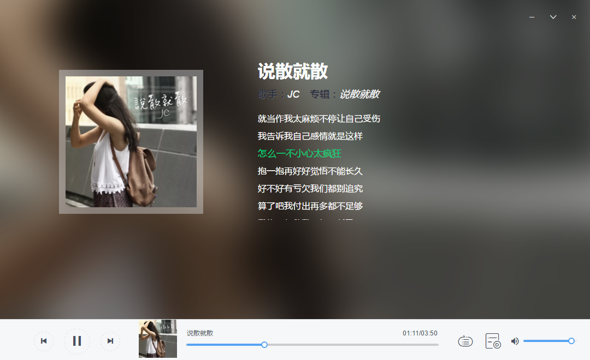
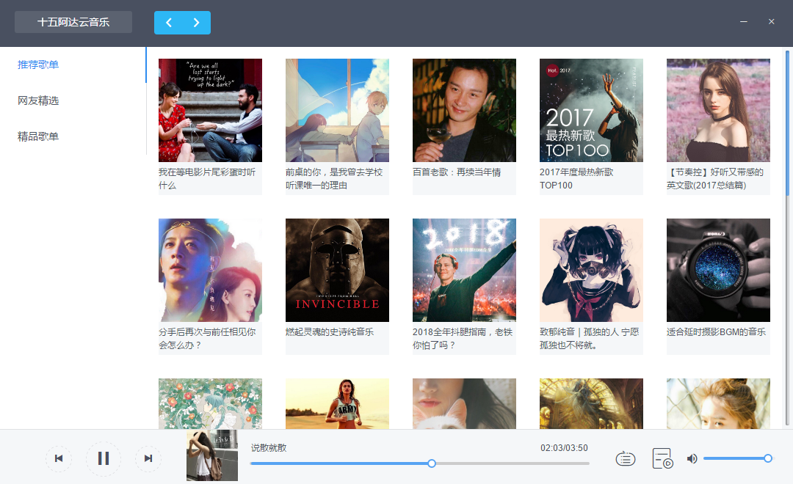
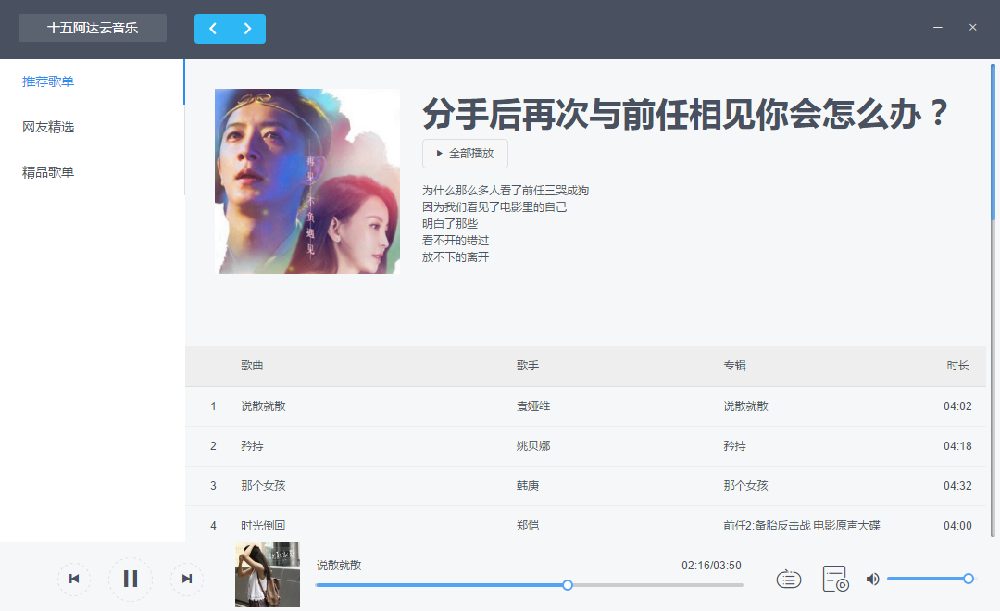

# 说明

从0开始学习，编写一个播放器练习

# HTML5 播放器

[Window64位程序下载](outApp/shiwu-win32-x64.zip)

界面模仿了网易云音乐，QQ音乐。

当前正在播放的列表未做

# 使用网易云 API

https://github.com/Binaryify/NeteaseCloudMusicApi

使用 30123 端口

打包好的程序里自动启动接口 30123

# 使用了一些Iview组件

https://github.com/iview/iview

界面布局，歌曲进度条，音量

歌单详情本来用的是table组件，后来发现歌曲很多的时候table性能非常低，所以就去掉了。

# 使用 Electron 打包

代码质量并不高，献丑了。






## Build Setup

``` bash
# install dependencies
npm install

# serve with hot reload at localhost:8080
npm run dev

# build for production with minification
npm run build

npm run build:win64

打包64位系统的程序
